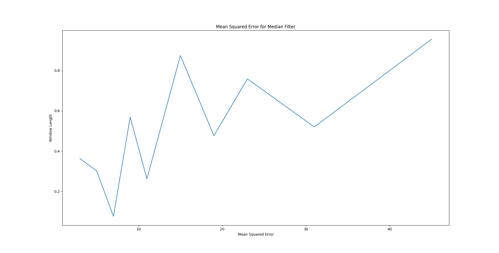
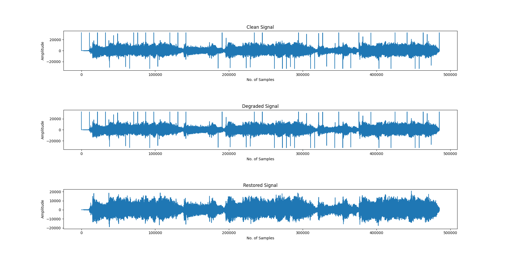
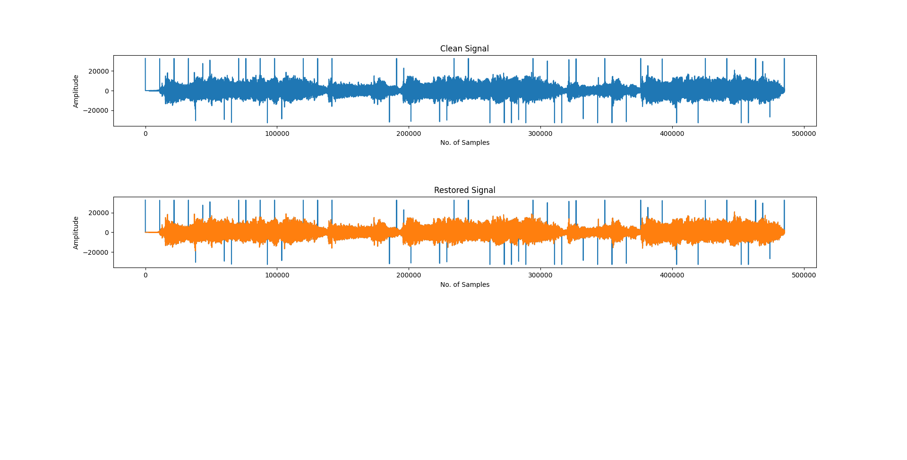
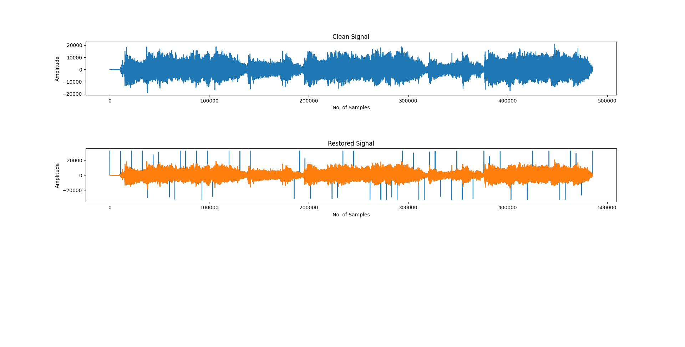

# Assignment - Audio Restoration in Python 
<!-- TABLE OF CONTENTS -->
<details>
  <summary>Table of Contents</summary>
  <ol>
    <li>
      <a href="## So whats this assignement about?">The Assignment</a>
    <li>
      <a href="## Interpolation techniques used :">Getting Started</a>
      <ul>
        <li><a href="### Median Filtering">Median Filtering</a></li>
        <li><a href="### Methodology">Methodology</a></li>
        <li><a href="### Results">Results</a></li>
        <li><a href="### Cubic Spline">Cubic Spline</a></li>
        <li><a href="### Methodology">Methodology</a></li>
        <li><a href="### Results">Results</a></li>
        </ul>
    </li>
    <li><a href="## Installation and Execution">Installation and Execution</a></li>
    <li><a href="**Conclusion**">Conclusion</a></li>
    <li><a href="## Credits">Credits</a></li>
    <li><a href="## Resources">Resources</a></li>
  </ol>
</details>

## So whats this assignement about?
Ever since Edison tinkered with the tinfoil cylinder phonogrpah in 1877 to reproduce a human voice, we have been constantly trying to find better ways to restore audio. Previously, we were working with Matlab to detect clicks in a noisy signal and we did try to restore the audio to a certain extent but were tied down with the scope of the model and the module. Now we move into the realm of python and have performed a couple of interpolation methods to restore the original audio. Taking a pinch of salt and ignoring the Mean Squared Error for a moment, we can hear the audio and say that we have been somewhat successful. Here is an attempt to explain the same. 

## Interpolation techniques used : 

### Median Filtering

Usually noise can be defined as some random variations in a Signal array. To over come this we use certain filters, like median filter in this case, which is used to interpolate and replace the unwanted values by sorting the array and taking the median of it and replacing it with the unwanted value. 

Example:
```sh                                 
Given Signal Array: [7 4 5 7 2 4]
Window Length: 3
Median Filter (Array): [7 4 5] → [4 5 7] → [5 7 4 5 7 2 4 ]
Repeat the same for the entire array
```
### Methodology
The code for Median Filter works in the following manner.
 1. We take the degraded Audio Signal, Beatles_corrupt2.wav and the degraded_clics.mat file consisting of all the clicks and convert them into arrays which we will be working on.
 2. We then take the input from the user to determine the filter length where the code is gonna only accept odd integer values and raise a warning for even inputs. 
 3. Next we pass these values through a for loop, which is designed to detect the indices of the clicks, match them with the degraded audio and run the median filter over the particular index to return the median value depending on the size of the window.
 4. This runs for all the indices with the clicks and replaces the values with median vaues.
 5. After getting the array with the restored values we calculate the Mean Squared Error using the original clean signal. 
 6. Finally we perform the unittest using the Scipy function for the median filter to check if our function works. 
### Results
The degraded audio signal was acurately restored [Restored](Restored_Median_7.wav) and the following were observed. 
1. Mean squared error (MSE) was calculated for different window lengths as shown in the graph attached below. 

2. The least MSE was determined corresponding to a window length of 7. 


3. The Average MSE came out to be ```0.5153555967841682 ```.


### Cubic Spline

Like median filtering, Cubic Spline is another interpolation technique used to denoise any given signal. Similar to piecewise polynomial interpolation but controllable by using "knots". This method is used to construct new values given specific known values and boundary conditions. The new values help construct a polynomial function called splice, with polynomial degree 3 in the case of a cubic spline. The interesting thing to note here is that the splice itself consists multiple polynomial functions. 

```sh                                 
Example: 
Input degraded signal: [5 4 1 4 7 1 8 1], Index Array: [0 1 2 3 4 5 6 7]
Array consisting of the clicks: [ 0 0 1 0 0 1 0 1]
Modified Signal Array, Y-Input : [5 4 4 7 8]
Modified Index Array, X-Input: [0 1 3 4 6]
Final restored output: [5 4 X 4 7 Y 8 Z], where X,Y,Z are the interpolated values
```

### Methodology
The code for Cubic Spline works as follows.
1. We take the degraded Audio Signal, Beatles_corrupt2.wav and the degraded_clics.mat file consisting of all the clicks and convert them into arrays which we will be working on. 
2. Now we need to take the degraded audio file and remove all the values corresponding to the index of the clicks.
3. Similar to step 2, we need to perform a similar deletion of values, but just an array of indices of the length of the degraded audio signal. (Refer to the example provided above)
4. Now that we have two arrays of similar length, we perform interpolation using Cubic Spline using the pre-made function available in Scipy. Here we take the x input as the array containing index values and y input as the array containing the degraded audio signal values minus the clicks. 
5. The output is a function which can be accessed by calling it over specific indices. We run it over the all the indices of the clicks and we get an interpolated value for each index value.
6. We replace these new values with the same index valued values of the orignal degraded signal. It sounds complicated but it isnt. 
7. Finally we compare the restored signal with the clean one to determine the mean squared error. 

### Results
The degraded audio signal was acurately restored [Restored Audio](Restored_aud_spline.wav)  and the following were observed. 
1. Mean Sqauared Error was calulcated with respect to the Clean Signal. It was recorded to be ``` MSE = 1.5630571016285302 ```.
2. The following are the graphs of the Audio signals.



---


## Installation and Execution

The details for the Python version and libraries (e.g. numpy version) used are here.
```sh                                 
matplotlib==3.6.2
numpy==1.23.5
qiskit==0.39.3
scikit_learn==1.1.3
scipy==1.9.3
tqdm==4.64.1

```
For more details check [here](https://github.com/bndr/pipreqs)


Afer installing all required packages you can run the files simply by typing:
```sh
python median_fltr.py
python CubicSpline.py
```
The exporting of the audio files have been comented out but it can be uncommented to write the wav files into the directory. 


**Conclusion**
 Comparing the two different interpolation methods, we notice that method of Median Filter achieves a lower MSE. The MSE of Median Filter method is marginally better but it gets worse as the window length increases. The runtime varies with respect to the Loading bar time, so calculating it acurately isnt feasible. The Cubic Spline method sounds better when listened to but thats a personal opinion. 


---
## Credits

This code was developed for purely academic purposes by Asrit Ganti, GitHub ID [asritganti](https://github.com/asritganti/Audio-Restoration) as part of the module 5c22 Computational Methods taught by [Prof. Angeliki Katsenou](https://angkats.github.io/). 

## Resources
1. Lecture Slides by Prof. Angeliki Katsenou and Prof. Anil Kokaram.
2. Scipy Cubic Spline function (https://docs.scipy.org/doc/scipy/reference/generated/scipy.interpolate.CubicSpline.html)
3. Timo Denk's Blog about the math behind cubic spline interpolation (https://timodenk.com/blog/cubic-spline-interpolation/)


